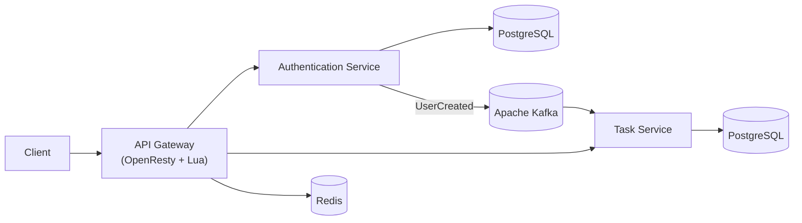

# BuzOp – Event-Driven Task Orchestration Platform

> A distributed task orchestration platform built with Java 21, Spring Boot 3, Apache Kafka, PostgreSQL, Redis, and OpenResty. Designed to demonstrate modern backend architecture patterns including microservices, event-driven communication, database-per-service, edge authentication, and eventual consistency.

---

# Table of Contents

- [Overview](#overview)
- [System Architecture](#system-architecture)
- [Authentication Architecture](#authentication-architecture)
- [Task Orchestration](#task-orchestration)
- [Handling Eventual Consistency](#handling-eventual-consistency)
- [Engineering Decisions](#engineering-decisions)
- [Reliability](#reliability)
- [Scalability](#scalability)
- [Tech Stack](#tech-stack)
- [Getting Started](#getting-started)
- [Future Improvements](#future-improvements)

---

# Overview

BuzOp is a distributed task orchestration platform designed around **event-driven microservices**.

Instead of tightly coupling services together through synchronous API calls, services communicate through **Apache Kafka**, allowing each domain to evolve, deploy, and scale independently.

The platform demonstrates several backend architecture patterns commonly used in production systems:

- Event-driven communication
- Database-per-service
- JWT-based authentication
- API Gateway
- Edge authentication
- Eventual consistency
- Idempotent event processing
- Containerized deployment

---

# System Architecture



---

## Components

### API Gateway (OpenResty + Lua)

Acts as the single entry point for every client request.

Responsibilities:

- Request routing
- JWT validation
- Rate limiting
- Reverse proxy
- Authentication at the network edge

Rather than forwarding every request to Spring Security, JWT validation is performed inside OpenResty using Lua scripts.

This reduces unnecessary traffic reaching backend services and centralizes security.

---

### Authentication Service

Responsible for user identity management.

Responsibilities:

- User registration
- Login
- Password hashing
- JWT generation
- User lifecycle events

Owns its own PostgreSQL database.

When a user signs up:

1. Authentication data is persisted.
2. JWT is generated.
3. A `UserCreated` event is published to Kafka.

Stored Data

```
userId
username
email
passwordHash
```

---

### Task Service

The Task Service owns all business logic.

Responsibilities:

- Task creation
- Task updates
- Task assignment
- Task completion
- User profile information
- Event processing

Owns an independent PostgreSQL database.

No authentication credentials are stored here.

---

### Apache Kafka

Kafka enables asynchronous communication between services.

Current Events

```
UserCreated
```

Future events may include

```
TaskCreated
TaskAssigned
TaskCompleted
TaskDeleted
NotificationCreated
```

Using Kafka allows services to remain loosely coupled and independently deployable.

---

### Redis

Redis is used for

- JWT lookup
- Session caching
- Fast authorization checks
- Rate limiting support

---

# Authentication Architecture

Authentication is completely isolated from business logic.

```
                User Signup
                     │
                     ▼
        Authentication Service
                     │
     Store credentials in database
                     │
             Generate JWT
                     │
        Publish UserCreated Event
                     │
                     ▼
               Apache Kafka
                     │
                     ▼
              Task Service
          Create User Profile
```

This separation ensures authentication and business services evolve independently.

---

# Handling Eventual Consistency

Because Kafka delivers messages asynchronously, there is a brief window where a user may successfully authenticate before the Task Service has consumed the `UserCreated` event.

To eliminate this race condition, the Task Service performs **Just-in-Time (JIT) User Provisioning**.

```
                 User Login
                      │
                      ▼
              Validate JWT
                      │
                      ▼
          Profile Exists?
             │          │
          Yes│          │No
             ▼          ▼
 Continue Request   Create Profile
                         │
                         ▼
                 Continue Request
```

Workflow

1. Validate JWT.
2. Extract `userId` and `email`.
3. Check whether the profile exists.
4. If missing, create the profile.
5. Continue processing the request.

When Kafka later delivers the `UserCreated` event, duplicate insertion is prevented using the unique `userId`.

This makes the operation **idempotent**.

---

# Task Orchestration

Business operations are performed inside the Task Service.

Typical request flow:

```
Client

↓

API Gateway

↓

Task Service

↓

Database

↓

(Optional)

Kafka Event

↓

Consumers
```

The architecture enables future expansion where multiple services react to task events without modifying the Task Service.

Example:

```
TaskCreated

↓

Kafka

├── Notification Service

├── Analytics Service

├── Audit Service

└── Reporting Service
```

This event-driven model significantly reduces service coupling.

---

# Engineering Decisions

## Why Microservices?

Separating authentication from business logic allows each service to evolve independently without affecting unrelated functionality.

---

## Why Kafka?

Kafka decouples producers from consumers.

Advantages:

- asynchronous communication
- fault tolerance
- independent deployments
- replayable events
- scalability

---

## Why Database per Service?

Each service owns its own data.

Advantages:

- loose coupling
- independent migrations
- better fault isolation
- independent scaling

---

## Why API Gateway?

The gateway centralizes

- authentication
- routing
- rate limiting
- request filtering

This avoids duplicating infrastructure concerns across services.

---

## Why JWT Validation at the Edge?

JWT verification occurs before requests reach Spring Boot services.

Benefits:

- lower backend load
- centralized authentication
- faster request rejection
- reduced unnecessary database lookups

---

## Why JIT User Provisioning?

Kafka provides eventual consistency.

JIT provisioning ensures users never experience login failures due to delayed event delivery.

---

# Reliability

The platform incorporates several resilience patterns.

- Database-per-service isolation
- Stateless backend services
- JWT validation at the gateway
- Event-driven communication
- Idempotent profile creation
- Graceful handling of eventual consistency
- Independent deployments
- Loose service coupling

---

# Scalability

The architecture is designed for horizontal scaling.

Examples include

- Multiple Auth Service instances
- Multiple Task Service instances
- Kafka consumer groups
- Kafka partitioning
- Independent PostgreSQL scaling
- Stateless gateway deployment
- Containerized services using Docker

---

# Tech Stack

## Backend

- Java 21
- Spring Boot 3
- Spring Security
- Spring Data JPA
- Maven

## Event Streaming

- Apache Kafka
- Spring Kafka

## Database

- PostgreSQL 16

## Cache

- Redis

## API Gateway

- Nginx
- OpenResty
- Lua

## Frontend

- React 19
- Vite
- Tailwind CSS
- Axios
- Chart.js

## Infrastructure

- Docker
- Docker Compose

---

# Getting Started

## Prerequisites

- Docker
- Docker Compose
- Java 21
- Node.js 20+
- Maven

---

## Clone Repository

```bash
git clone https://github.com/pathak77/Event-Driven-Task-Orchestration-Platform.git

cd buzop
```

---

## Configure Environment

Create a `.env` file.

Example variables

```
JWT_SECRET=

POSTGRES_USER=

POSTGRES_PASSWORD=
```

---

## Start Infrastructure

```bash
docker compose up --build -d
```

---

## Services

| Service | Port |
|----------|------|
| API Gateway | 80 |
| Auth Service | 5500 |
| Task Service | 8080 |
| Auth PostgreSQL | 5432 |
| Task PostgreSQL | 5431 |
| Redis | 6379 |
| Kafka | 9092 |

---

## Frontend

```bash
cd frontend

npm install

npm run dev
```

---

# Future Improvements

- Distributed tracing using Jaeger
- Centralized logging using ELK
- Metrics with Prometheus + Grafana
- Circuit breakers using Resilience4j
- Testcontainers integration testing
- Kubernetes deployment
- Outbox Pattern for reliable event publishing
- Saga Pattern for distributed workflows
- Dead Letter Queue (DLQ) for Kafka consumers
- Event versioning
- OAuth2 / OIDC integration
- Refresh Token rotation
- Multi-region deployment

---

# Architecture Highlights

- Java 21 + Spring Boot 3

- Event-Driven Microservices

- Apache Kafka

- Database per Service

- JWT Authentication

- OpenResty API Gateway

- Redis Caching

- Dockerized Infrastructure

- Edge Authentication

- Eventual Consistency Handling

- Idempotent User Provisioning

- Horizontal Scalability

---

> This project was built to explore production-inspired backend architecture patterns, emphasizing scalability, resilience, service isolation, and event-driven system design using the modern Java ecosystem.
